# flask-hello-world-devops-project
Build and deploy code a simple flask application using Jenkins and Kubernetes
 
In this project, we are going to build a simple [CI/CD](https://www.atlassian.com/continuous-delivery/principles/continuous-integration-vs-delivery-vs-deployment) pipeline from scratch using tools like Flask, Docker, Git, Github, Jenkins and Kubernetes.
 
## Prerequisites
 
* Python
* Flask
* Docker
* Git and Github
* Jenkins
* Kubernetes
* Linux machine
 
## Steps in the CI/CD pipeline
1. Create a "Hello world" Flask application
2. Write basic test cases
3. Dockerise the application
4. Test the code locally by building docker image and running it
5. Create a github repository and push code to it
6. Start a Jenkins server on a host
7. Write a Jenkins pipeline to build, test and push the docker image to Dockerhub.
8. Set up Kubernetes on a host using [Minikube](https://minikube.sigs.k8s.io/docs/start/)
9. Create a Kubernetes deployment and service for the application.
10. Use Jenkins to deploy the application on Kubernetes
 
## Project structure
 
* app.py - Flask application which will print "Hello world" when you run it
* test.py - Test cases for the application
* requirements.txt - Contains dependencies for the project
* Dockerfile - Contains commands to build and run the docker image
* Jenkinsfile - Contains the pipeline script which will help in building, testing and deploying the application
* deployment.yaml - [Kubernetes deployment](https://kubernetes.io/docs/concepts/workloads/controllers/deployment/) file for the application
* service.yaml - [Kubernetes service](https://kubernetes.io/docs/concepts/services-networking/service/) file for the application
 
## Create a project repository on Github
 
Login to your github account and create a new repository. Do make sure that you have given a unique name for the repository. It's good to add a README file, Python .gitignore template and choose a licence.
 
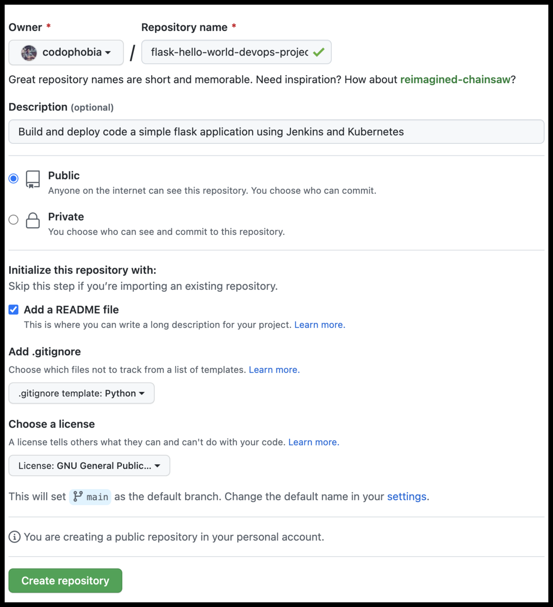
 
Click on "create repository". Now, the repository is created.
 
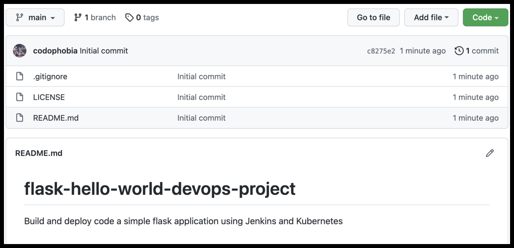
 
## Clone the repository on your system
 
Go to your Github repository. Click on the "Code" section and note down the HTTPS url for the project.
 
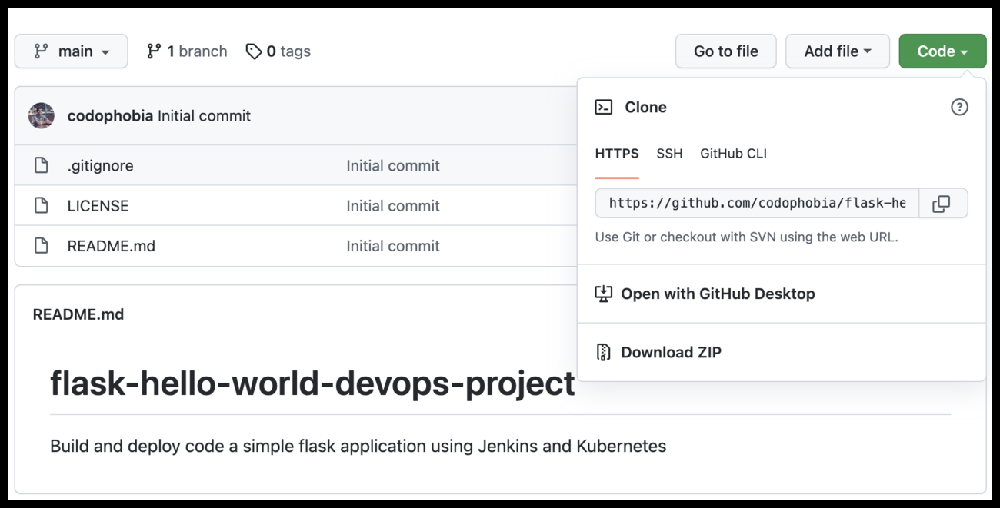
 
Open terminal on your local machine(Desktop/laptop) and run the below commands.
 
```
git clone https://github.com/codophobia/flask-hello-world-devops-project.git # Replace the url with the url of your project
cd flask-hello-world-devops-project
```
 
Run ls command and you should be able to see a local copy of the github repository.
 
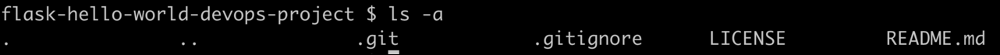
 
## Set up virtual Python environment
 
Setting up a [virtual Python environment](https://docs.python.org/3/library/venv.html) will help in testing the code locally and also collecting all the dependencies.
 
```bash
python3 -m venv venv # Create the virtual env named venv
source venv/bin/activate # Activate the virtual env
```
 
## Create a Flask application
 
Install the flask module.
 
```bash
pip install flask
```
 
Open the repository that you have just cloned in your favourite text editor.
Create a new file named "app.py" and add the below code.
 
```python
from flask import Flask
import os
 
app = Flask(__name__)
 
 
@app.route("/")
def hello():
   return "Hello world!!!"
 
 
if __name__ == "__main__":
   port = int(os.environ.get("PORT", 5000))
   app.run(debug=True, host='0.0.0.0', port=port)
```
 
The above code when run will start a web server on port number 5000. You can test the code by running it.
 
```bash
python app.py
```
 
You should see the output below after running the above command.
 
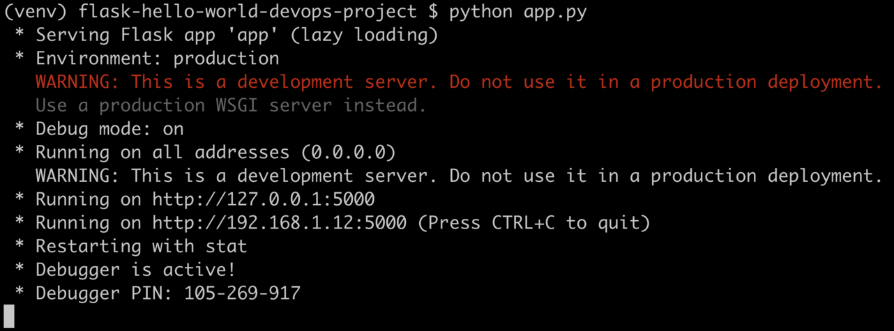
 
Open your browser and visit [](http://127.0.0.1:5000). You should see "Hello world" printed on the browser.
 
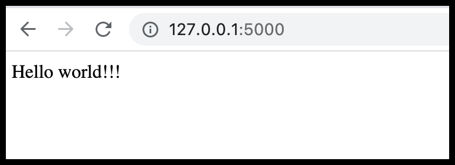
 
## Write test cases using pytest
 
Install [pytest](https://docs.pytest.org/en/7.1.x/) module. We will use pytest for testing.
 
```bash
pip install pytest
```
 
Create a new file named "test.py" and add a basic test case.
 
```python
from app import app
 
 
def test_hello():
   response = app.test_client().get('/')
   assert response.status_code == 200
   assert response.data == b'Hello world!!!'
```
 
Run the test file using pytest.
 
```bash
pytest test.py
```
 
## Run code quality tests using flake
 
It's always recommended to write quality code with proper coding standards, proper code formatting and code with no syntax errors.
 
[Flake8](https://flake8.pycqa.org/en/latest/) can be used to check the quality of the code in Python.
 
Install the flake8 module.
 
```bash
pip install flake8
```
 
Run flake8 command.
 
```bash
flake8 --exclude venv # Ignore files in venv for quality check
```
 
If you do not see any output, it means that everything is alright with code quality.
 
Try removing the spaces between commas in the app.py and then run flake8 command again. You should see the following errors.
 
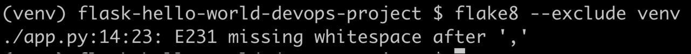
 
Add space again and you will not see the error now.
 
## Dockerise the application
 
Install docker on your system. Follow [https://docs.docker.com/get-docker/](https://docs.docker.com/get-docker/)
 
Create a file named "Dockerfile" and add the below code.
 
```
FROM python:3.6
MAINTAINER Shivam Mitra "shivamm389@gmail.com" # Change the name and email address
COPY app.py test.py /app/
WORKDIR /app
RUN pip install flask pytest flake8 # This downloads all the dependencies
CMD ["python", "app.py"]
```
 
Build the docker image.
 
```bash
docker build -t flask-hello-world .
```
 
Run the application using docker image.
 
```bash
docker run -it -p 5000:5000 flask-hello-world
```
 
Run test case
 
```bash
docker run -it flask-hello-world pytest test.py
```
 
Run flake8 tests
 
```bash
docker run -it flask-hello-world flake8
```
 
You can verify if the application is running by opening the page in the browser.
 
Push the image to dockerhub. You will need an account on docker hub for this.
 
```bash
docker login # Login to docker hub
docker tag flask-hello-world shivammitra/flask-hello-world # Replace <shivammitra> with your docker hub username
docker push shivammitra/flask-hello-world
```
 
## Push the code to github
 
Till now, we haven't pushed the code to our remote repository. Let's try some basic git commands to push the code.
 
```bash
git add .
git commit -m "Add flask hello world application, test cases and dockerfile"
git push origin main
```
 
If you go to the github repository, you should see the changes.
 
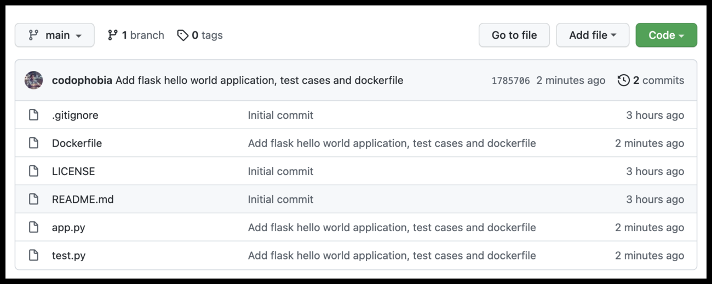
 
## Install Jenkins
 
In this example, we will be installing Jenkins on Ubuntu 20.04 Linux machine. If you have a different Linux distribution, follow steps mentioned at [https://www.jenkins.io/doc/book/installing/linux/](https://www.jenkins.io/doc/book/installing/linux/)
 
Run the following commands on the server.
 
```bash
# Install jenkins
 
curl -fsSL https://pkg.jenkins.io/debian-stable/jenkins.io.key | sudo tee \
/usr/share/keyrings/jenkins-keyring.asc > /dev/null
 
echo deb [signed-by=/usr/share/keyrings/jenkins-keyring.asc] \
https://pkg.jenkins.io/debian-stable binary/ | sudo tee \
/etc/apt/sources.list.d/jenkins.list > /dev/null
 
sudo apt-get update
sudo apt install openjdk-11-jre
sudo apt-get install jenkins
 
# Install docker and add jenkins user to docker group
# Installing docker is important as we will be using jenkins to run docker commands to build and run the application.
sudo apt install docker.io
sudo usermod -aG docker jenkins
sudo service jenkins restart
```
 
Open your browser and visit [http://127.0.0.1:8080](http://127.0.0.1:8080). If you have installed Jenkins on a Aws/Azure/GCP virtual machine, use the public address of the VM in place of localhost. If you are not able to access the cloud, make sure that port 8080 is added to the inbound port.
 
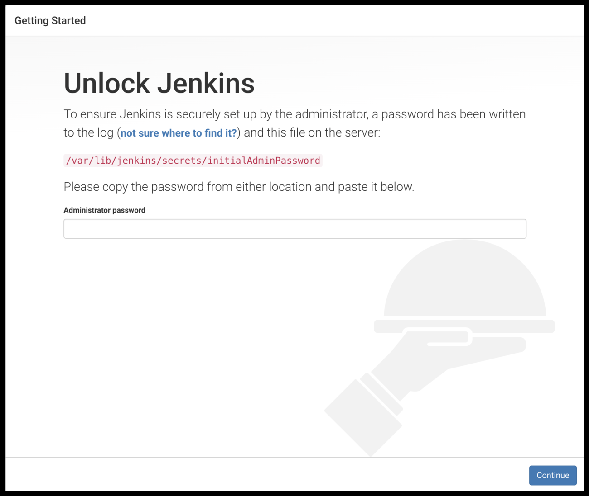
 
Copy the admin password from the path provided on the jenkins homepage and enter it. Click on "Install suggested plugins". It will take some time to install the plugins.
 
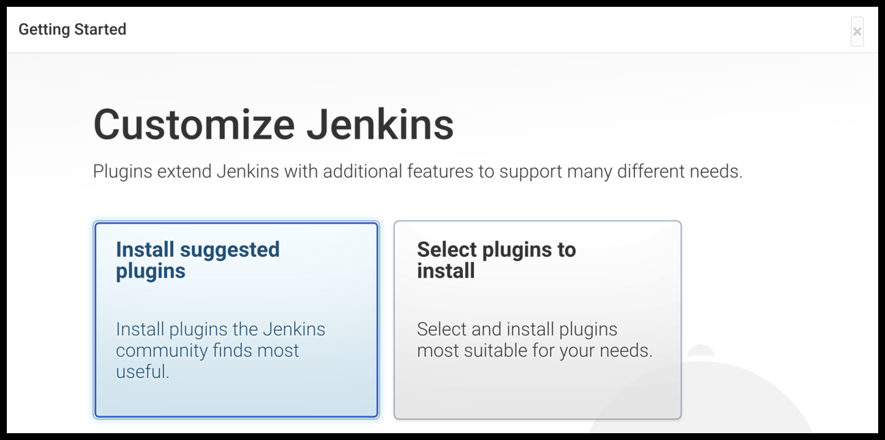
 
Create a new user.
 

 
You should now see the jenkins url. Click next and you should see the "Welcome to jenkins" page now.
 
## Create a Jenkins pipeline
 
We will now create a Jenkins pipeline which will help in building, testing and deploying the application.
 
Click on "New Item" on the top left corner of the homepage.
 
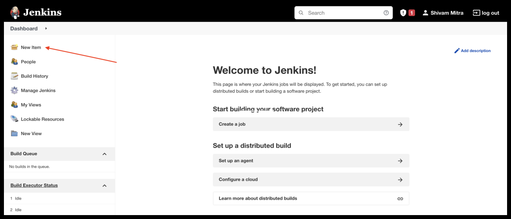
 
Enter a name, select "Pipeline" and click next.
 
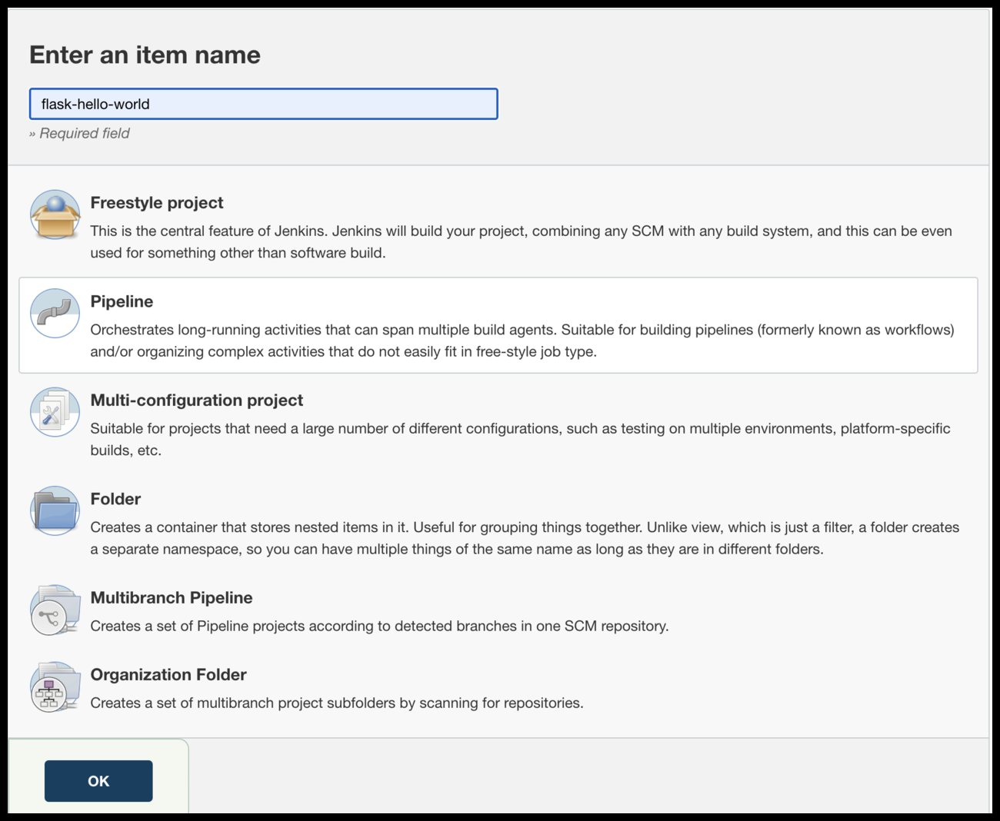
 
We now need to write a [pipeline script](https://www.jenkins.io/doc/book/pipeline/syntax/) in Groovy for building, testing and deploying code.
 

 
Enter the below code in the pipeline section and click on "Save".
 
```
pipeline {
   agent any
  
   environment {
       DOCKER_HUB_REPO = "shivammitra/flask-hello-world"
       CONTAINER_NAME = "flask-hello-world"
 
   }
  
   stages {
       stage('Checkout') {
           steps {
               checkout([$class: 'GitSCM', branches: [[name: '*/main']], extensions: [], userRemoteConfigs: [[url: 'https://github.com/codophobia/flask-hello-world-devops-project']]])
           }
       }
       stage('Build') {
           steps {
               echo 'Building..'
               sh 'docker image build -t $DOCKER_HUB_REPO:latest .'
           }
       }
       stage('Test') {
           steps {
               echo 'Testing..'
               sh 'docker stop $CONTAINER_NAME || true'
               sh 'docker rm $CONTAINER_NAME || true'
               sh 'docker run --name $CONTAINER_NAME $DOCKER_HUB_REPO /bin/bash -c "pytest test.py && flake8"'
           }
       }
       stage('Deploy') {
           steps {
               echo 'Deploying....'
               sh 'docker stop $CONTAINER_NAME || true'
               sh 'docker rm $CONTAINER_NAME || true'
               sh 'docker run -d -p 5000:5000 --name $CONTAINER_NAME $DOCKER_HUB_REPO'
           }
       }
   }
}
```
 
Click on the "Build Now" button at the left of the page.
 
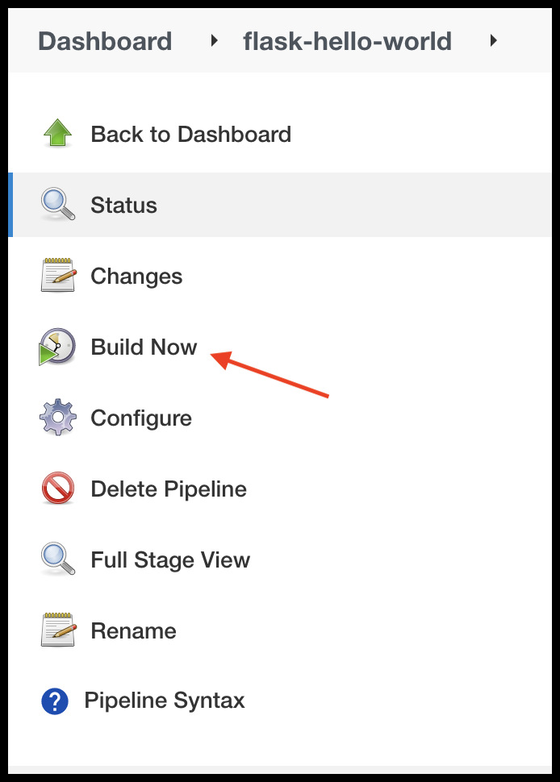
 
The pipelines should start running now and you should be able to see the status of the build on the page.
 
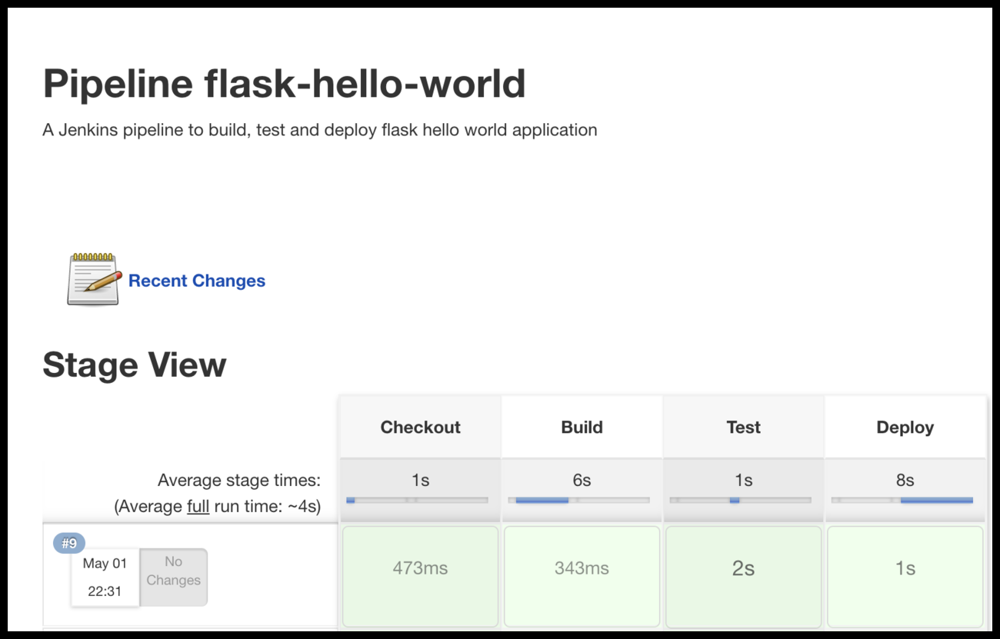
 
If the build is successful, you can visit [http://127.0.0.1:5000](http://127.0.0.1:5000) and you should see "Hello world" on the browser. If you have installed Jenkins on a Aws/Azure/GCP virtual machine, use the public address of the VM in place of localhost. If you are not able to access the cloud, make sure that port 5000 is added to the inbound port.
 
## Pipeline script from SCM
 
We can also store the Jenkins pipeline code in our github repository and ask Jenkins to execute this file.
 
Go to the "flask-hello-world" pipeline page and click on "Configure".
 
Change definition from "Pipeline script" to "Pipeline script from SCM" and fill details on SCM and github url. Save the pipeline.
 
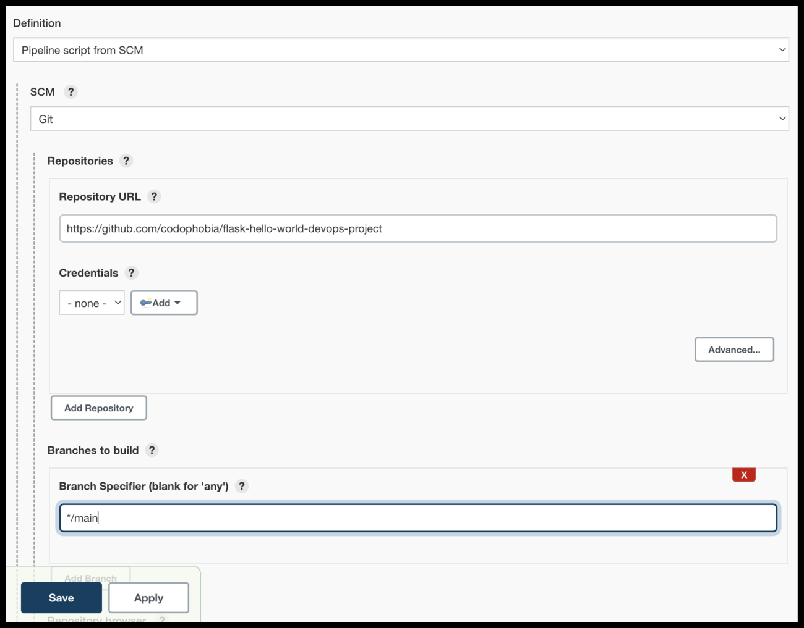
 
Now, create a new file named "Jenkins" in our local code repository and add the below pipeline code.
 
```
pipeline {
   agent any
  
   environment {
       DOCKER_HUB_REPO = "shivammitra/flask-hello-world"
       CONTAINER_NAME = "flask-hello-world"
 
   }
  
   stages {
       /* We do not need a stage for checkout here since it is done by default when using the "Pipeline script from SCM" option. */
      
 
       stage('Build') {
           steps {
               echo 'Building..'
               sh 'docker image build -t $DOCKER_HUB_REPO:latest .'
           }
       }
       stage('Test') {
           steps {
               echo 'Testing..'
               sh 'docker stop $CONTAINER_NAME || true'
               sh 'docker rm $CONTAINER_NAME || true'
               sh 'docker run --name $CONTAINER_NAME $DOCKER_HUB_REPO /bin/bash -c "pytest test.py && flake8"'
           }
       }
       stage('Deploy') {
           steps {
               echo 'Deploying....'
               sh 'docker stop $CONTAINER_NAME || true'
               sh 'docker rm $CONTAINER_NAME || true'
               sh 'docker run -d -p 5000:5000 --name $CONTAINER_NAME $DOCKER_HUB_REPO'
           }
       }
   }
}
```
 
Push the code to github.
 
```bash
git add .
git commit -m "Add Jenkinsfile"
git push origin main
```
 
Go to "flask-hello-world" pipeline page and click on "Build Now"
 
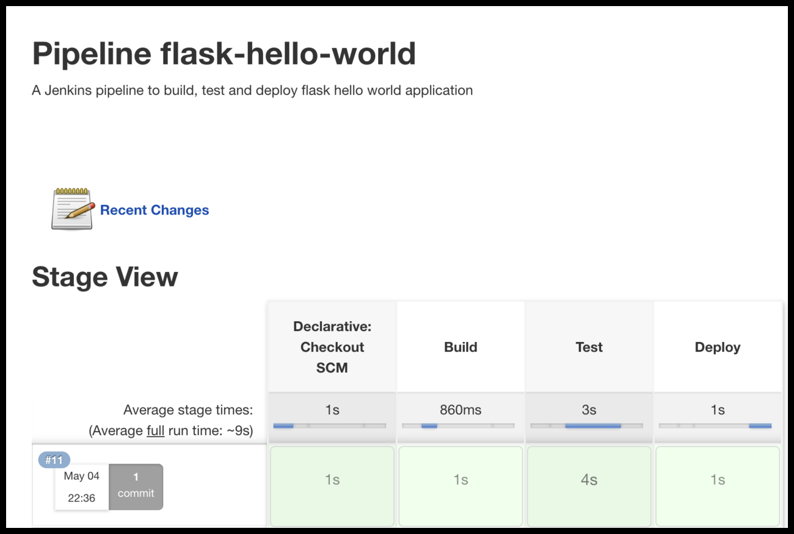
 
## Install Kubernetes
 
In this example, we will be installing kubernetes on Ubuntu 20.04 Linux machine using minikube. If you are on cloud, you can create a new instance and install kubernetes on that.
 
```bash
# https://minikube.sigs.k8s.io/docs/start/
 
# Install docker for managing containers
sudo apt-get install docker.io
 
# Install minikube
curl -LO https://storage.googleapis.com/minikube/releases/latest/minikube-linux-amd64
sudo install minikube-linux-amd64 /usr/local/bin/minikube
 
# Add the current USER to docker group
sudo usermod -aG docker $USER && newgrp docker
 
# Start minikube cluster
minikube start
 
# Add an alias for kubectl command
alias kubectl="minikube kubectl --"
```
 
Create a new file named "deployment.yaml" in your project and add the below code.
 
```
apiVersion: apps/v1
kind: Deployment
metadata:
 name: flask-hello-deployment # name of the deployment
 
spec:
 template: # pod defintion
   metadata:
     name: flask-hello # name of the pod
     labels:
       app: flask-hello
       tier: frontend
   spec:
     containers:
       - name: flask-hello
         image: shivammitra/flask-hello-world:latest
 replicas: 3
 selector: # Mandatory, Select the pods which needs to be in the replicaset
   matchLabels:
     app: flask-hello
     tier: frontend
```
 
Test the deployment manually by running the following command:
 
```bash
$ kubectl apply -f deployment.yaml
deployment.apps/flask-hello-deployment created
$ kubectl get deployments flask-hello-deployment
NAME                     READY   UP-TO-DATE   AVAILABLE   AGE
flask-hello-deployment   3/3     3            3           45s
```
 
Create a new file named "service.yaml" and add the following code
 
```
apiVersion: v1
kind: Service
metadata:
 name: flask-hello-service-nodeport # name of the service
 
spec:
 type: NodePort # Used for accessing a port externally
 ports:
   - port: 5000 # Service port
     targetPort: 5000 # Pod port, default: same as port
     nodePort: 30008 # Node port which can be used externally, default: auto-assign any free port
 selector: # Which pods to expose externally ?
   app: flask-hello
   tier: frontend
```
 
Test the service manually by running below commands.
 
```bash
$ kubectl apply -f service.yaml
service/flask-hello-service-nodeport created
$ kubectl get service flask-hello-service-nodeport
NAME                           TYPE       CLUSTER-IP     EXTERNAL-IP   PORT(S)          AGE
flask-hello-service-nodeport   NodePort   10.110.46.59   <none>        5000:30008/TCP   36s
```
 
Run below command to access the application on the browser.
 
```bash
minikube service flask-hello-service-nodeport
```
 
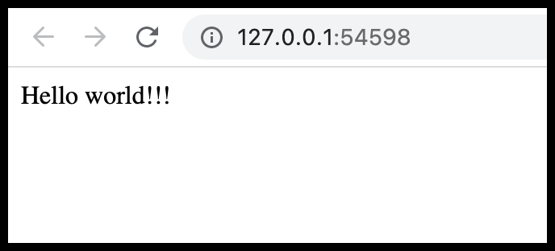
 
Finally, push the updated code to github.
 
```bash
git add .
git commit -m "Add kubernetes deployment and service yaml"
git push origin main
```
 
## Deploy using jenkins on kubernetes
 
First, we will add our docker hub credential in jenkins. This is needed as we have to first push the docker image before deploying on kubernetes.
 
Open jenkins credentials page.
 
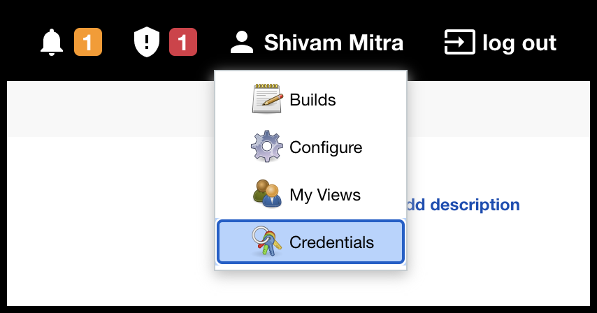
 
Click on 'global'.
 
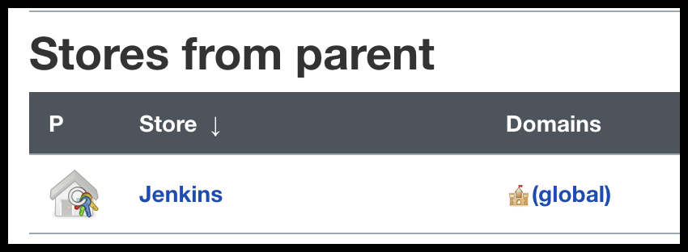
 
Add the credentials for docker hub account.
 
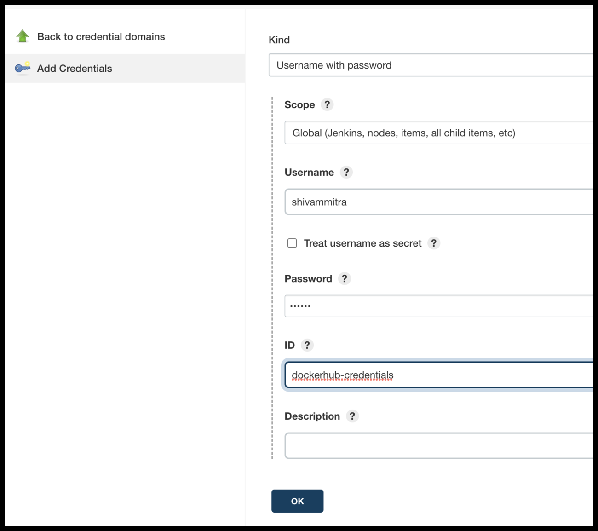
 
We will now modify our Jenkinsfile in the project to push the image and then deploy the application on kubernetes.
 
```
pipeline {
   agent any
  
   environment {
       DOCKER_HUB_REPO = "shivammitra/flask-hello-world"
       CONTAINER_NAME = "flask-hello-world"
       DOCKERHUB_CREDENTIALS=credentials('dockerhub-credentials')
   }
  
   stages {
       /* We do not need a stage for checkout here since it is done by default when using "Pipeline script from SCM" option. */
      
       stage('Build') {
           steps {
               echo 'Building..'
               sh 'docker image build -t $DOCKER_HUB_REPO:latest .'
           }
       }
       stage('Test') {
           steps {
               echo 'Testing..'
               sh 'docker stop $CONTAINER_NAME || true'
               sh 'docker rm $CONTAINER_NAME || true'
               sh 'docker run --name $CONTAINER_NAME $DOCKER_HUB_REPO /bin/bash -c "pytest test.py && flake8"'
           }
       }
       stage('Push') {
           steps {
               echo 'Pushing image..'
               sh 'echo $DOCKERHUB_CREDENTIALS_PSW | docker login -u $DOCKERHUB_CREDENTIALS_USR --password-stdin'
               sh 'docker push $DOCKER_HUB_REPO:latest'
           }
       }
       stage('Deploy') {
           steps {
               echo 'Deploying....'
               sh 'minikube kubectl -- apply -f deployment.yaml'
               sh 'minikube kubectl -- apply -f service.yaml'
           }
       }
   }
}
```
 
Commit the changes to github.
 
```bash
git add .
git commit -m "Modify Jenkinsfile to deploy on kubernetes"
git push origin main
```
 
Go to "flask-hello-world" pipeline page and click on "Build Now"
 
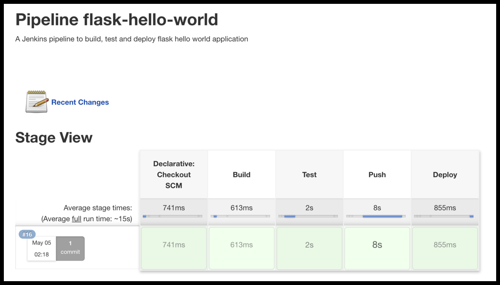
 
## Is the Kubernetes host different from the jenkins host ?
 
In case you have set up kubernetes on a different virtual machine, we will need to ssh to this machine from jenkins machine, copy the deployment and service files and then run kubernetes commands.
 
Create a ssh key pair on jenkins server.
 
```bash
$ cd ~/.ssh # We are on jenkins server
$ ssh-keygen -t rsa # select the default options
$ cat id_rsa.pub # Copy the public key
```
 
Add the public key we created to authorized_keys on kubernetes server.
 
```bash
$ cd ~/.ssh # We are on kubernetes server
$ echo "<public key>" >> authorized_keys
```
 
Modify the 'Deploy' section of Jenkinsfile. Replace <username> and <ip address> with the username and ip address of kubernetes host respectively.
 
```
stage('Deploy') {
   steps {
       echo 'Deploying....'
       sh 'scp -r -o StrictHostKeyChecking=no deployment.yaml service.yaml < username>@<ip address>:~/'
 
       sh 'ssh <username><ip address> kubectl apply -f ~/deployment.yaml'
       sh 'ssh <username><ip address> kubectl apply -f ~/service.yaml'
   }
}
```
 
Commit the code. Build the pipeline again on Jenkins server.
 
## Conclusion
 
In this tutorial, we have tried to build a very simple CI/CD pipeline using jenkins and kubernetes. Do note that this is only for learning purposes. If you are creating a CI/CD pipeline for production use, follow the official docs of jenkins and kubernetes for the best practices.